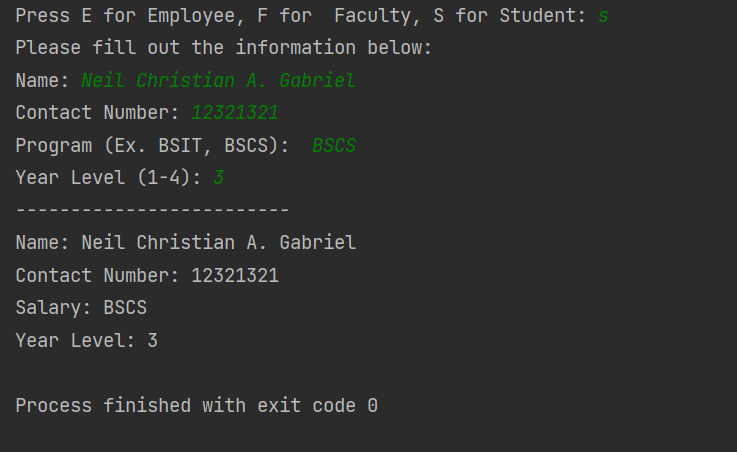

<p align="center">
  
</p>

<h1 align="center">CollegeList</h1>

<p align="center">
  <a href="#project-description">Project Description</a> • 
  <a href="#features">Features</a> • 
  <a href="#oop-concepts-used">OOP Concepts Used</a> •
  <a href="#tech-stack">Tech Stack</a> • 
  <a href="#installation">Installation</a> • 
  <a href="#usage">Usage</a>
</p>

<p align="center">
  
</p>

---

## Project Description

**CollegeList** is a Java console application created as a **university lab exercise**.  
It demonstrates **Object-Oriented Programming (OOP)** by modeling different people in a college setting, such as **Students, Employees, and Faculty**, and displaying their details.  

---

## Features

- Accepts multiple entries of `Student`, `Employee`, and `Faculty`  
- Prompts user for relevant details (program, year level, department, rank, etc.)  
- Displays formatted information of all entered persons  
- Console-based interface  

---

## OOP Concepts Used

- **Encapsulation** – class fields are grouped logically with related methods  
- **Inheritance** – `Student`, `Employee`, and `Faculty` inherit from a base `Person` class  
- **Polymorphism** – overridden methods (e.g., `toString`) provide specific behavior for each subclass  
- **Abstraction** – common attributes/behaviors are factored into the abstract parent class  

---

## Tech Stack

- **Language**: Java  
- **IDE**: IntelliJ IDEA (or any Java IDE)  

---

## Installation

```bash
git clone https://github.com/nca-gabriel/CollegeList.git
cd CollegeList
```
---
## Usage

Compile & Run via CLI:

cd src
javac CollegeList.java
java CollegeList


Run via IntelliJ IDEA:

Open the project in IntelliJ IDEA

Right-click CollegeList.java → Run 'CollegeList.main()'
